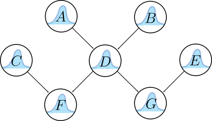
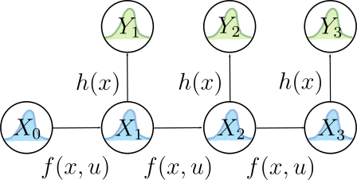
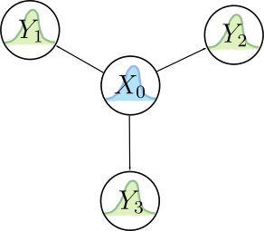

# Bayesian Inference

*Fundamental theory of recovering state information from noisy data.*

## Bayesian Networks and Their Joint Distributions

Inference is the mechanism by which observations are translated into useful data, and probabilistic inference is necessary to deal with uncertainty in both your sources of information and in your models. **Bayes nets** provide a way to visualize and think about arbitrary inference models. They represent these relationships with acyclic graphs (since it doesn't make sense to have a circular inference relationship) like the one below:

where \\(A\\), \\(B\\), \\(C\\), \\(D\\), \\(E\\), \\(F\\), and \\(G\\) are all random variables (not just Gaussian, but arbitrary distributions) whose relationships are dictated by the edges in the graph. For example, an edge connecting \\(A\\) to \\(D\\) indicates an inference/generative/measurement model for \\(D\\) given an observation of \\(A\\). Take a second to think a little bit more about this relationship. There should be a function \\(h(a\in A)\\) that defines the \\(D\\) distribution as a function of the \\(A\\) distribution. So once \\(A\\) (and \\(B\\)) have been observed or input as priors, then we can calculate what \\(D\\) looks like as a distribution. *But there’s another possibility*. Say we suddenly got a direct observation of \\(D\\) and wanted to use that to infer about what \\(A\\) should look like, we could do so using Bayes’ rule:

$$P(A|D)=\frac{P(D|A)P(A)}{P(D)}=\eta P(D|A)P(A).$$

In the formula above, \\(P(A|D)\\) can be thought of as a posterior distribution for \\(A\\) (a refined version of the prior belief, \\(P(A)\\)) given the conditional encoded by \\(h(a\in A)\\) in the \\(D\\) node, which is formally expressed as \\(P(D|A)\\). This means that we can “reverse” the arrow in a sense to refine our knowledge of \\(A\\) given \\(D\\). It’s actually a little more complicated since \\(B\\) also feeds into \\(D\\), but we’re ignoring that for clarity. So in a Bayes net, the belief of a parent node both influences the shape of its child node‘s belief according to a measurement model and also can be refined by observations made on the child node via Bayes’ rule (also thanks to the measurement model). It’s very important to understand this concept for probabilistic intuition. That being said, it’s actually possible to get by without that intuition since the process for solving a query given observations on leaf nodes will essentially have Bayes’ rule baked into it. More on that later.

In aggregate, the entire net encodes the *joint* distribution of all of its random variables, \\(P(A,B,C,D,E,F,G)\\), which assigns a probability value to every possible permutation of the variables.

The shape of the Bayes net helps us calculate its joint distribution, but first we need to understand some fundamental principles:

----

  * **(Conditional) Independence:** If \\(A\\) and \\(B\\) are independent, then their joint is just \\(P(A,B)=P(A)P(B)\\). Otherwise, it is given by \\(P(A,B)=P(A|B)P(B)=P(B|A)P(A)\\). Furthermore, in a Bayes net, *each node is independent of all other nodes, given its parents and children*.
  * **Chain Rule:** The conditional probability rule can be repeatedly applied to break up a large joint distribution: \\(P(A,B,C)=P(A|B,C)P(B,C)=P(A|B,C)P(B|C)P(C)\\)

----

Applying these rules to the net above, we get its joint distribution:

$$P(A,B,C,D,E,F,G)=P(F|C,D)P(G|D,E)P(D|A,B)P(A)P(B)P(C)P(E)$$

## Constraint Satisfaction Problems and Their Application to Solving Bayes Net Queries

It's great that we can derive joint distributions from a Bayes net, but what we usually actually care about is answering *queries*. That is, deducing the probabilities of arbitrary random variables in the net given some observations. In order to answer queries, we need to think of Bayes net as one giant constraint satisfaction problem (CSP). In essence, we can think of the individual probability distributions as "flexible" constraints, where the flexibility is afforded by uncertainty. Imagine if there were no process/measurement noise on any of the variables in a net. Then there would be ONE rigid/brittle explanation for a set of observations, and the explanation would be found by solving a CSP. In fact, lots of reasoning tasks can be cast as CSP's, like sets of logical propositions, systems of linear equations, and, of course, Bayes nets for probabilistic inference.

All CSP's can be solved with the same methodology, which can be summarized thus:

----

**Given:** A set of variables, corresponding variable domains, a family of constraints (together consisting a “knowledge base”), and some variable value observations.

**Desired:** The allowable values of the specified variable(s) of interest that were not directly observed. 

Perform the following steps\*:

  - **Determine all sets of variable value combinations that satisfy the entire family of constraints:** This is done with a *join* operation on all of the constraints to create one giant (self-consistent) constraint, with the extraneous constraints automatically dropped.
  - **Query to obtain only the value(s) of the variable(s) of interest:** This is done with a series of *project* operations to eliminate all of the assigned variable values from the giant constraint set.

\*If the structure of the knowledge base allows, you can interweave the join and project steps to avoid doing a massive join operation (or even allow for a recursive query algorithm to appear!).

----

This process is like solving a system of equations, but allowing for multiple/many different solutions. It doesn’t get more general than that when it comes to constraints. An algorithmic manifestation of this process is called *bucket elimination*. So, what do these join and project operations look like when applied to Bayes Nets? This table will explain:

| CSP Terminology  | Bayes Version                                                                                    |
| ---------------- | ------------------------------------------------------------------------------------------------ |
| Variables        | Random variables                                                                                 |
| Variable Domains | All possible (discrete or continuous) values of the random variables                             |
| Join             | Creation of a joint distribution                                                                 |
| Project          | Marginalization of random variables that haven’t been observed and aren’t part of the query set. |

You can also use Bayes rule to condition on variables whose values are actually knowable. Luckily, the conditional independence properties of Bayes nets also allows for interweaving the join/project operations via factoring. For example, take the Bayes net from the first section. Say we wanted to do a query to get the joint distribution of a subset of the variables, \\(P(A,B,F,G)\\). We would first start with the big join operation over all constraints (which are the inference models encoded by the graph) to get the global joint distribution:

$$P(A,B,C,D,E,F,G)=P(F|C,D)P(G|D,E)P(D|A,B)P(A)P(B)P(C)P(E)$$

Then we would marginalize out the un-queried variables to get our query answer:

$$P(A,B,F,G)=P(A)P(B)\sum_D P(D|A,B) \sum_C P(F|C,D)P(C) \sum_E P(G|D,E) P(E)$$

Notice how we intelligently rearranged the factors of the joint so that the summations from right to left feed into each successive sum.

## Dynamic Bayes Nets

A special case of the Bayes net is the dynamic Bayes net, which is also referred to as a hidden Markov model (HMM). Here’s an example of an HMM:

which encodes the joint probability distribution

$$P(Y_3|X_3)P(X_3|X_2)P(Y_2|X_2)P(X_2|X_1)P(Y_1|X_1)P(X_1|X_0)P(X_0)$$

Most *dynamic* (i.e. with a moving robot) robotics estimation problems can be cast into this form, where \\(Y_i\\) is a sensor observation, \\(X_i\\) is the robot state, and \\(h(x)\\) and \\(f(x,u)\\) are the measurement and dynamic models, respectively. The random variables \\(X_i,Y_i\\) need not be Gaussian, though they are often assumed to be. \\(h(x)\\) and \\(f(x,u)\\) define the mean and variance (and perhaps other properties, in the non-Gaussian case) for the \\(Y_i\\) and \\(X_i\\) distributions, which are all thought of as conditional (since they’re all child nodes) with \\(i>0\\).

Let’s apply the join/project CSP technique to our HMM to derive some of the most important inference algorithms: *filtering* and *smoothing* for hidden (unobserved) state queries/estimation.

### Derivation of Filtering Query Algorithm

Let’s apply the filtering paradigm to the HMM above. For the filter calculation, we have available to us observations of \\(Y_1\\), \\(Y_2\\), and \\(Y_3\\), and wish to know the PDF of the most recent hidden state, \\(X_3\\). This basically means that we want \\(P(X_3,Y_1,Y_2,Y_3)\\) since it's proportional to \\(P(X_3|Y_1,Y_2,Y_3)\\) via the law of independence.

Once again, step one is to begin with the join operation to get the joint of all constraints (distributions), which we already have:

$$P(X_i,Y_i)=P(Y_3|X_3)P(X_3|X_2)P(Y_2|X_2)P(X_2|X_1)P(Y_1|X_1)P(X_1|X_0)P(X_0)$$

The next step is to elminimate all variables that aren't part of the query ($X_3,Y_1,Y_2,Y_3$) via marginalization:

$$P(X_3,Y_1,Y_2,Y_3)=P(Y_3|X_3)\sum_{X_2}P(X_3|X_2)P(Y_2|X_2)\sum_{X_1}P(X_2|X_1)P(Y_1|X_1)\sum_{X_0}P(X_1|X_0)P(X_0)$$

\\[ =P(Y_3|X_3)\sum_{X_2}P(X_3|X_2)P(Y_2|X_2)\sum_{X_1}P(X_2|X_1)P(Y_1|X_1)P(X_1) \\]

\\[ =P(Y_3|X_3)\sum_{X_2}P(X_3|X_2)P(Y_2|X_2)\sum_{X_1}P(X_2|X_1)P(X_1,Y_1) \\]

\\[ =P(Y_3|X_3)\sum_{X_2}P(X_3|X_2)P(Y_2|X_2)P(X_2)P(Y_1) \\]

\\[ =P(Y_3|X_3)\sum_{X_2}P(X_3|X_2)P(X_2,Y_1,Y_2) \\]

\\[ =P(Y_3|X_3)P(X_3)P(Y_2)P(Y_1) \\]

\\[ =P(X_3,Y_1,Y_2,Y_3). \\]

In the expansions above, the inter-variable (in)dependence relationships dictated by the HMM structure determine how individual PDF's should be multiplied together. The expansions were also done to demonstrate a recursive relationship afforded by the fact that we ordered the summations intelligently.

The filtering algorithm can thus be summarized with the following recursive relation.

----

$$k=0,1,\dots$$

$$P(X_k|Y_{1:k})=\eta P(X_k,Y_{1:k})=\eta P(Y_k|X_k)\sum_{X_{k-1}}[P(X_k|X_{k-1})P(X_{k-1}|Y_{1:k-1})],$$

$$P(X_0|Y_0)=P(X_0)~\text{(Prior)}.$$

----

When the random variables are continuous, we substitute in integrals for the summations. We'll also differentiate a prediction and update step for practical application:

----

\\[ k=0,1,\dots \\]

\\[ \text{Prediction Step:} \\]

\\[ \hat{x}^{-}\_k=\int P(X_k|X\_{k-1}=x)\hat{x}^{+}\_{k-1}(X\_{k-1}=x)dx \\]

\\[ x_k=\int P(X_k|X_{k-1})x_{k-1}(X_{k-1})dx \\]

$$\text{Update Step:}$$

$$\hat{x}^+_k=\eta P(Y_k|X_k)\hat{x}^-_k$$

----

where \\( \hat{x}\_k \triangleq P(X\_k|Y\_{1:k}) \\). **Particle filtering** directly approximates this algorithm using Monte Carlo integration.

### Derivation of Smoothing Query Algorithm

We will now do a very similar derivation of the smoothing algorithm for HMM's. This time, we have the same measurements \\(Y_1\\), \\(Y_2\\), \\(Y_3\\) available, but want to deduce \\(X_1\\), which is in the "past". Similarly to above, what we want to find is \\(P(X_1,Y_1,Y_2,Y_3)\\) since it's proportional to \\(P(X_1|Y_1,Y_2,Y_3)\\).

We start off with the same joint distribution as with the filtering derivation. First, notice that we can just apply the filtering algorithm up to \\(X_1\\) to obtain \\(P(X_1,Y_1)\\) so that we only have to deal with the terms with \\(i>1\\). Next, the main difference here is that we are querying for a different hidden state, so we need to marginalize out \\(X_2\\) and \\(X_3\\) instead of \\(X_1\\) and \\(X_2\\) from the remaining joint terms:

$$P(Y_3|X_3)P(X_3|X_2)P(Y_2|X_2)P(X_2|X_1)$$

The marginalization is most easily done with a re-ordering of terms since we'll need to start at \\(i=3\\) to end up back at \\(X_1\\):

$$\sum_{X_2}P(Y_2|X_2)P(X_2|X_1)\sum_{X_3}P(Y_3|X_3)P(X_3|X_2)=P(X_1,Y_2,Y_3).$$

This is the term encompassing the contribution of *future* measurements to the belief on \\(X_1\\). To get the final answer, multiply a normalization term with \\(P(X_1,Y_1)\\) and \\(P(X_1,Y_2,Y_3)\\) (since they're conditionally independent distributions) to get the full \\(P(X_1|Y_1,Y_2,Y_3)\\).

With discrete probability distributions, the recursive algorithm can be summarized as

----

**Query:** \\(X_N~~,~N\geq 1\\)

**Observations:** \\(Y_1,\cdots,Y_M~~,~M>N\\)

  - Filter to obtain \\(P(X_N|Y_{1:N})\\)
  - Obtain smoothing term \\(P(X_N,Y_{N+1:M})\\) through the recursive relationship:

$$k=M,M-1,\cdots,N+1$$

$$P(X_{k-1},Y_{k:M})=\eta \sum_{X_k}P(Y_k|X_k)P(X_k|X_{k-1})P(X_k,Y_{k+1:M}),$$

$$P(X_{M-1},Y_{M:M})=\eta \sum_{X_M}P(Y_M|X_M)P(X_M|X_{M-1}).$$

**Answer:** \\(\eta P(X_N,Y_{N+1:M})P(X_N|Y_{1:N})\\)

---

## Static Bayes Nets

Contrast the dynamic Bayes net with that of a static process (where the “robot” state has no dynamics), pictured below:

This net is also referred to as a [naive Bayes classifier](https://en.wikipedia.org/wiki/Naive_Bayes_classifier), an important tool in the world of statistics. The joint for this static configuration is given by

$$P(X_0,Y_1,Y_2,Y_3)=P(Y_3|X_0)P(Y_2|X_0)P(Y_1|X_0)P(X_0)$$

and querying for \\(X_0\\) given \\(Y_i\\) is conceptually simple; you just take the joint distribution as your answer, as there is no need to marginalize with no hidden states. While this is conceptually simple, practically there are different algorithmic approaches to take.

In robotics, if the random variables are Gaussian and the measurement models \\(h_i(x) \sim P(Y_i|X_0)\\) are linear, then we can use *linear static estimation* techniques (like weighted linear least squares) for queries on \\(X_0\\) given \\(Y_i\\). With Gaussian variables and nonlinear measurement models, we can use *nonlinear static estimation* techniques (like weighted nonlinear least squares) for such queries.

## Beyond the Basics

There are many algorithms used in different domains that leverage (or can be related directly to) Bayesian inference. Here are some that you will see pop up in robotics:

  * Sequential Monte Carlo (Particle Filtering)
  * The Kalman filter and its variants
  * Weighted least squares regression
  * Markov Chain Monte Carlo

A pretty good discussion on Bayesian inference, sequential Monte Carlo, and Markov Chain Monte Carlo can be found in *UPCcourse-handouts.pdf* from [this course website](http://hedibert.org/markov-chain-monte-carlo-and-sequential-monte-carlo-methods-in-dynamic-models-and-stochastic-volatility-models/).
