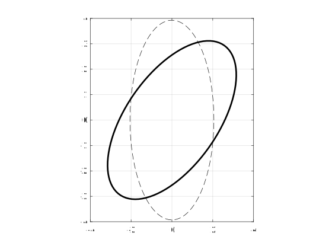

# Visualizing Matrices

There are various scenarios (e.g., covariance matrices, inertia matrices, quadratic forms) in which you'd want to represent a (square) matrix visually, and ultimately it comes down to Eigen decompositions.

In graphics, it's generally preferable to draw an "unrotated" version of your graphic, and then apply a rotation. Thus, the methods below will focus on extracting **semi-major axis lengths** and a **rotation** from the Eigen decomposition. Example code will be given in **Matlab**.

For testing, here's some Matlab code for generating a random $n\times n$ positive-definite matrix:

<code matlab>
function A = generateSPDmatrix(n)
% Generate a dense n x n symmetric, positive definite matrix

A = rand(n,n); % generate a random n x n matrix

% construct a symmetric matrix using either
A = 0.5*(A+A'); OR
A = A*A';
% The first is significantly faster: O(n^2) compared to O(n^3)

% since A(i,j) < 1 by construction and a symmetric diagonally dominant matrix
%   is symmetric positive definite, which can be ensured by adding nI
A = A + n*eye(n);

end
</code>
## Two/Three-Dimensional Positive Definite Matrix (Ellipse/Ellipsoid)

**Matrix:** $\boldsymbol A\in \mathbb{R}^{2\times 2}$ or $\boldsymbol A\in \mathbb{R}^{3\times 3}$, $\boldsymbol A > 0$

**Get the principal axis lengths:**

  - Find eigenvalues of $\boldsymbol A$. These are the (ordered) semi-major axis lengths.
    * Let's say that by convention, $\boldsymbol A$ is expressed in frame $W$, and when it's expressed in frame $F$, it's diagonal ($\boldsymbol D$) with the eigenvalues on the diagonal.

**Get the rotation matrix:**

  - Find the (ordered) eigenvectors of $\boldsymbol A$. These form the column vectors of $\boldsymbol R_F^W$.
  - Check the determinant of $\boldsymbol R_F^W$; if it's -1, then flip the sign of the last column to make the determinant +1.
  - From [matrix basis change rules](autonomy:math:linear-algebra:identities#changing_the_basis_of_a_matrix_equivalent_transforms_eigen_decomposition_interpretation), you can check your work by making sure that $\boldsymbol D=\left(\boldsymbol R_F^W\right)^{-1}\boldsymbol A\boldsymbol R_F^W$.

**Matlab code:**

<code matlab>
% Get random positive definite matrix
A = generateRandom2x2PDMatrix();

% Extract axis lengths and rotation
[R,D] = eig(A);
x_axis_len = D(1,1);
y_axis_len = D(2,2);
if det(R) < 0
    R(:,2) = -1 * R(:,2);
end

% Draw unrotated ellipse
theta = linspace(0,2*pi,100);
coords = [x_axis_len * cos(theta); y_axis_len * sin(theta)];
plot(coords(1,:),coords(2,:),'k--')
hold on; grid on

% Draw rotated ellipse (R acts like active rotation
% since it's B2W convention
rotated_coords = R * coords;
plot(rotated_coords(1,:),rotated_coords(2,:),'k-','Linewidth',2.0)
hold off

A

function A = generateRandom2x2PDMatrix()
A = rand(2,2);
A = A*A';
A = A + 2*eye(2);
end
</code>

$$\boldsymbol A=\begin{bmatrix}3.0114 & 0.9353\\0.9353 & 2.9723\end{bmatrix}$$

