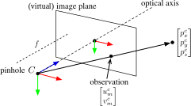
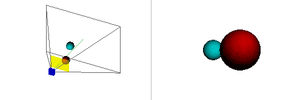
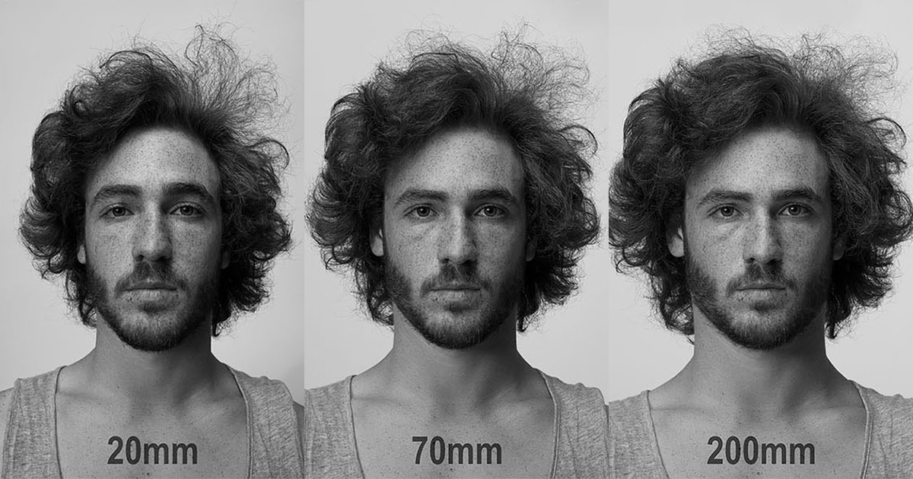

# The Pinhole Camera Model: Fundamentals for Geometric Computer Vision

Based on some very useful readings: [VO - Scaramuzza and Fraundorfer](http://rpg.ifi.uzh.ch/visual_odometry_tutorial.html), [State Estimation for Robotics - Barfoot](http://asrl.utias.utoronto.ca/~tdb/bib/barfoot_ser17.pdf).

## The Pinhole Camera Model

In essence, the camera model (utilizing the virtual image plane, and not the "true," flipped image plane *behind* the camera optical center) uses similar triangles in the camera \\(x\\) and \\(y\\) axes (normalized by \\(z\\)) to project a 3D point onto the image plane, losing depth information in the process:

$$p_{z}^{c}\begin{bmatrix}u_{m}^{c}\\\\ v_{m}^{c}\\\\ 1 \end{bmatrix}=\begin{bmatrix}f & 0 & 0\\\\ 0 & f & 0\\\\ 0 & 0 & 1 \end{bmatrix}\begin{bmatrix}p_{x}^{c}\\\\ p_{y}^{c}\\\\ p_{z}^{c} \end{bmatrix}=\begin{bmatrix}f & 0 & 0\\\\ 0 & f & 0\\\\ 0 & 0 & 1 \end{bmatrix}\boldsymbol{p}^{c}.$$

To convert the point to pixels, consider the following pixel model (accommodating skew):

$$u^{I}=s_{x}u_{m}^{c}+o_{x},\;\;v^{I}=s_{y}v_{m}^{c}+o_{y},$$

which, once we add the possibility of cross-skew (i.e., non-rectangular pixels), gives the point-to-pixels projection model:

$$p_{z}^{c}\begin{bmatrix}u^{I}\\\\ v^{I}\\\\ 1 \end{bmatrix}=\begin{bmatrix}s_{x}f & s_{\theta}f & o_{x}\\\\ 0 & s_{y}f & o_{y}\\\\ 0 & 0 & 1 \end{bmatrix}\boldsymbol{p}^{c}=\boldsymbol{K}\boldsymbol{p}^{c}.$$

\\(\boldsymbol{K}\\) is called the **intrinsic (calibration) matrix**.

Say that the 3D point is expressed in a different frame, \\(W\\), than the camera frame. We need to augment the point with homogeneous coordinates \\(\tilde{\boldsymbol{p}}^{W}=\begin{bmatrix}\left(\boldsymbol{p}^{W}\right)^{T} & 1\end{bmatrix}^{T} \\) and apply the **extrinsic (calibration) matrix** \\(\begin{bmatrix}\boldsymbol{R}_{W}^{c} &\boldsymbol{t}_{W}^{c}\end{bmatrix}\\):

$$p_{z}^{c}\begin{bmatrix}u^{I}\\\\ v^{I}\\\\ 1 \end{bmatrix}=\boldsymbol{K}\begin{bmatrix}\boldsymbol{R}_{W}^{c} & \boldsymbol{t}_{W}^{c}\end{bmatrix}\tilde{\boldsymbol{p}}^{W}=\boldsymbol{\Pi}\tilde{\boldsymbol{p}}^{W},$$

where \\(\boldsymbol{\Pi}\\) is the **projection matrix**. If the point is already expressed in the camera frame, as before:

$$p_{z}^{c}\begin{bmatrix}u^{I}\\\\ v^{I}\\\\ 1 \end{bmatrix}=\boldsymbol{K}\begin{bmatrix}\boldsymbol{I} & \boldsymbol{0}\end{bmatrix}\tilde{\boldsymbol{p}}^{c}=\boldsymbol{\Pi}_{0}\tilde{\boldsymbol{p}}^{c},$$

where \\(\boldsymbol{\Pi}_{0}\\) is called the **canonical projection**. Some more terminology:

- \\(\begin{bmatrix}o_x & o_y\end{bmatrix}\\) is the **principal point**.
- \\(s_xf=f_x\\) is the **focal length in horizontal pixels** (\\(s_x\\) pixels per meter)
- \\(s_yf=f_y\\) is the **focal length in vertical pixels**
- \\(s_x/s_y\\) is the **aspect ratio**
- \\(s_\theta f\\) is the pixel **skew**

Aside from 3D-to-2D projection, a normal camera will probably impose some sort of distortion on the points, which will not preserve straight lines in the projection. See [this OpenCV link](https://docs.opencv.org/3.4/d4/d94/tutorial_camera_calibration.html) for an example distortion model (e.g., barrel, radial, pincushion) and how to correct for it.

Consider the qualitative effects of modifying the intrinsic parameters of a camera on how a 3D scene "looks" when projected onto the image plane. For example, the figures below help visualize what happens when the focal length is changed. A shorter focal length *widens* the field of view, appearing to push back further objects on the periphery when your view window is constrained to be the same size:

### Alternative Parameterizations

**Focal Length: Pixels vs. Millimeters**

To convert between pixels and millimeters, you need the "sensor width/height" (both are needed if \\(f_x\\) and \\(f_y\\) are different) information. Call it \\(\sigma\\). Then,

$$f_\text{pixels}=L_\text{pixels}\frac{f_\text{mm}}{\sigma_\text{mm}},$$

where \\(L\\) is either image plane width or height. This is a matter of canceling out units and using the image vs. sensor dimensions to scale things.

**FOV vs. Focal Length**

$$\theta=2\tan^{-1}\left(\frac{L}{2f}\right) \iff f=\frac{L}{2\tan(\theta/2)},$$

where \\(\theta\\) is horizontal/vertical FOV and \\(L\\) is image plane width/height, respectively. Note that \\(L\\) and \\(f\\) must have the same units (e.g., pixels, millimeters, etc.).

## Vanishing Points

*All parallel lines* in 3D space eventually intersect *at a vanishing point*, whether or not that point is within the camera field of view (with some notable exceptions).

With \\(o_{x}=o_{y}=s_{\theta}=0\\) and \\(f=s_{x}=s_{y}=1\\), the intrinsic matrix becomes the identity. Thus, with any 3D point in the camera frame \\(\boldsymbol{p}=\begin{bmatrix}x & y & z\end{bmatrix}^{T} \\), the projection relationship becomes

$$\begin{bmatrix}u^{I}\\\\ v^{I} \end{bmatrix}=\begin{bmatrix}x/z\\\\ y/z \end{bmatrix}.$$

Consider the generalized equation for a line in 3D space, parameterized by \\(\lambda\\) and oriented by unit vector \\(\hat{\boldsymbol{r}}^{c}\\), expressed in the camera frame:

$$\boldsymbol{p}^{c}(\lambda)=\boldsymbol{p}_{0}^{c}+\lambda\hat{\boldsymbol{r}}^{c}.$$

Substituting the projection equation into the line equation gives the following pixel coordinates (also parameterized by \\(\lambda\\)) for \\(\boldsymbol{p}\\) in the image plane:

$$u_{p}(\lambda) =\frac{p_{0,x}^{c}+\lambda\hat{r}_{x}^{c}}{p_{0,z}^{c}+\lambda\hat{r}_{z}^{c}},$$

$$v_{p}(\lambda) =\frac{p_{0,y}^{c}+\lambda\hat{r}_{y}^{c}}{p_{0,z}^{c}+\lambda\hat{r}_{z}^{c}}.$$

The vanishing point can be found in the limit as \\(\lambda\rightarrow\infty\\):

$$\lim_{\lambda\rightarrow\infty}u_{p}(\lambda) =\frac{\hat{r}_{x}^{c}}{\hat{r}_{z}^{c}},$$

$$\lim_{\lambda\rightarrow\infty}v_{p}(\lambda) =\frac{\hat{r}_{y}^{c}}{\hat{r}_{z}^{c}}.$$

These equations indicate that the vanishing point depends only on \\(\hat{\boldsymbol{r}}^{c}\\), so *any set of* parallel lines in 3D space will share the same vanishing point in the image plane.

To find a condition in which no vanishing point exists, consider setting \\(\hat{r}_{z}^{c}\\) equal to zero. In that case, the limits above don't exist, suggesting that no vanishing point exists. In other words, if two parallel lines are confined to a plane parallel to the image plane, then they will never appear to intersect when projected onto the image plane.

## Camera-Based Relative Pose Calculation

A central problem in geometric computer vision is recovering the relative pose (rotation and translation) between two camera viewpoints from feature correspondences observed in both images. Given matched feature points between two images, there are three main approaches depending on the type of information available. All three methods commonly employ [RANSAC](https://en.wikipedia.org/wiki/Random_sample_consensus) for outlier rejection, since each requires only a small number of point correspondences to compute a solution--making them well-suited to the hypothesize-and-verify loop that RANSAC provides.

### The Essential and Fundamental Matrices

Before diving into the specific methods, it helps to understand the **essential matrix** \\(\boldsymbol{E}\\), which encodes the geometric relationship between two calibrated camera views. Given a point \\(\boldsymbol{p}\\) observed in both camera frames as normalized image coordinates \\(\boldsymbol{q}_1\\) and \\(\boldsymbol{q}_2\\) (i.e., with intrinsics removed: \\(\boldsymbol{q}=\boldsymbol{K}^{-1}\tilde{\boldsymbol{u}}\\)), the essential matrix satisfies the **epipolar constraint**:

$$\boldsymbol{q}_2^T \boldsymbol{E} \, \boldsymbol{q}_1 = 0.$$

The essential matrix is defined as

$$\boldsymbol{E} = \boldsymbol{t}^{\wedge} \boldsymbol{R},$$

where \\(\boldsymbol{R}\\) and \\(\boldsymbol{t}\\) are the relative rotation and translation between the two camera frames, and \\(\boldsymbol{t}^{\wedge}\\) denotes the skew-symmetric matrix form of \\(\boldsymbol{t}\\). Because \\(\boldsymbol{E}\\) is constructed from a unit-norm translation direction and a rotation, it has exactly five degrees of freedom (three for rotation, two for translation direction--the magnitude of translation is unrecoverable from image correspondences alone).

When the camera intrinsics are not known, the **fundamental matrix** \\(\boldsymbol{F}\\) is used instead. It relates pixel coordinates directly:

$$\tilde{\boldsymbol{u}}_2^T \boldsymbol{F} \, \tilde{\boldsymbol{u}}_1 = 0,$$

and is related to the essential matrix by \\(\boldsymbol{F} = \boldsymbol{K}_2^{-T} \boldsymbol{E} \, \boldsymbol{K}_1^{-1}\\). The fundamental matrix has seven degrees of freedom (nine entries minus one for scale, minus one from the \\(\det(\boldsymbol{F})=0\\) constraint).

### 2D-2D Correspondences

*Input: feature points from image A, feature points from image B.*

When only 2D feature correspondences are available (the most common case for a monocular camera), the relative pose is recovered through the essential matrix:

1. The **five-point algorithm** estimates \\(\boldsymbol{E}\\) from at least five point correspondences. Each correspondence provides one equation via the epipolar constraint, and the five degrees of freedom of \\(\boldsymbol{E}\\) require a minimum of five points. In practice, the algorithm solves a system that enforces both the epipolar constraints and the algebraic properties of essential matrices (i.e., that its singular values are \\(\\{\sigma, \sigma, 0\\}\\)).
2. The relative rotation \\(\boldsymbol{R}\\) and translation direction \\(\hat{\boldsymbol{t}}\\) are extracted from \\(\boldsymbol{E}\\) via SVD. The decomposition yields four possible solutions (two rotations times two translation directions); the physically correct one is selected by checking that triangulated points land in front of both cameras (positive depth, or "cheirality" check).

When intrinsics are unknown, the **eight-point algorithm** can be used to estimate the fundamental matrix \\(\boldsymbol{F}\\) instead, requiring at least eight correspondences (since \\(\boldsymbol{F}\\) has seven DOF plus one equation fixes the scale).

Translation is only determined up to a scale factor--this is a fundamental ambiguity of monocular geometry, since a scene and its camera motion can be uniformly scaled without changing the images.

### 2D-3D Correspondences

*Input: 2D feature points from the current image, 3D points triangulated from previous images (or from a known map).*

When 3D structure is already available (e.g., from prior triangulation or a pre-built map), the camera pose can be recovered directly using **Perspective-n-Point (PnP)** algorithms. Given \\(n\\) correspondences between known 3D points \\(\boldsymbol{p}_i\\) and their observed 2D projections \\(\boldsymbol{u}_i\\), PnP finds the camera pose \\((\boldsymbol{R}, \boldsymbol{t})\\) such that

$$\boldsymbol{u}_i \sim \boldsymbol{K} \begin{bmatrix} \boldsymbol{R} & \boldsymbol{t} \end{bmatrix} \tilde{\boldsymbol{p}}_i$$

for all \\(i\\). A minimum of three correspondences is required (the P3P case), which yields up to four possible solutions that can be disambiguated with a fourth point. The pose recovered by PnP is **fully determined**--including the scale of translation--because the 3D point positions provide an absolute reference.

### 3D-3D Correspondences

*Input: 3D point clouds from image A and image B. Usually available with RGB-D sensors or stereo cameras.*

When both views produce 3D point clouds (e.g., from depth sensors), the relative transform can be computed directly from matched 3D-3D correspondences. Given corresponding point sets \\(\\{\boldsymbol{p}_i\\}\\) and \\(\\{\boldsymbol{p}_i'\\}\\), we seek the transform that minimizes

$$\sum_i \left\| \boldsymbol{p}_i' - (\boldsymbol{R}\boldsymbol{p}_i + \boldsymbol{t}) \right\|^2.$$

This can be solved in closed form using SVD on the cross-covariance matrix of the centered point sets. When scale drift is a concern (as can happen over long trajectories), a **similarity transform** \\((\boldsymbol{R}, \boldsymbol{t}, s)\\) can be estimated instead of a rigid-body transform, adding a scale factor that absorbs accumulated drift. The [Iterative Closest Point (ICP)](https://en.wikipedia.org/wiki/Iterative_closest_point) algorithm generalizes this approach to handle cases where explicit point correspondences are not known, iteratively alternating between establishing nearest-neighbor correspondences and solving for the transform.

## The Homography Matrix

A **homography** is an invertible mapping between two images of the same planar surface (or, equivalently, between any two images related by a pure camera rotation with no translation). It is represented by a \\(3\times 3\\) matrix \\(\boldsymbol{H}\\) that maps homogeneous pixel coordinates from one image to another:

$$\tilde{\boldsymbol{u}}_2 \sim \boldsymbol{H} \, \tilde{\boldsymbol{u}}_1,$$

where \\(\sim\\) denotes equality up to scale. The matrix \\(\boldsymbol{H}\\) has eight degrees of freedom (nine entries minus one for the overall scale ambiguity) and can be estimated from a minimum of four point correspondences (each providing two equations).

For a planar scene with surface normal \\(\hat{\boldsymbol{n}}\\) at distance \\(d\\) from the first camera, the homography between two calibrated views is given by

$$\boldsymbol{H} = \boldsymbol{K}_2 \left( \boldsymbol{R} + \frac{\boldsymbol{t}\hat{\boldsymbol{n}}^T}{d} \right) \boldsymbol{K}_1^{-1},$$

where \\(\boldsymbol{R}\\) and \\(\boldsymbol{t}\\) are the relative rotation and translation between cameras. In the special case of pure rotation (\\(\boldsymbol{t}=\boldsymbol{0}\\)), this simplifies to \\(\boldsymbol{H} = \boldsymbol{K}_2 \boldsymbol{R} \boldsymbol{K}_1^{-1}\\), which holds regardless of scene geometry.

Common applications of the homography include:

- **Image stitching / panoramas:** When the camera rotates but does not translate, the homography maps the entire scene between views, enabling seamless panoramic mosaics.
- **Planar rectification:** A homography can warp a perspective view of a planar surface into a fronto-parallel (top-down) view, useful in applications like document scanning or sports field analysis.
- **Projector calibration:** The mapping between a projector's output and the surface it illuminates is a homography when the surface is planar.
- **Augmented reality:** Overlaying virtual content onto a detected planar surface (e.g., a marker or tabletop) requires estimating and applying a homography.
