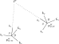

# 2D Range-Bearing Landmark Resolution with Ceres

FIXME **UNDER CONSTRUCTION** FIXME

**High-level problem description:** A moving vehicle confined to the 2D plane is equipped with a range-bearing device that is giving noisy 2D range and bearing measurements pointing to a static landmark at regular intervals. The bearing error in the measurement can be thought of as a product of noise as well as a steady bias, whereas the range measurement is just noisy. The goal is to incrementally collapse uncertainty about where the static landmark is by moving the vehicle around and continually collecting noisy and biased measurements.

This article will lay out some approximating equations to solve this problem and provide a Python script to test out the solution together with some high-level observations.
## Prerequisite Readings

  * Math context: [[public:autonomy:search-optimization:least-squares]]
  * Solver context: [[public:autonomy:implementation:opt-libs:ceres]]

## Running the Python Demo

If you wish to run/modify the demo yourself, you’ll need to install these Python packages:

  * numpy
    * For working with vectors and some basic linear algebra.
  * matplotlib
    * For visualization.
  * [ceres_python_bindings](https://github.com/Edwinem/ceres_python_bindings)$^*$
    * Third-party Python bindings for Ceres **< 2.1.0**. Provides the core library API discussed above.
  * [geometry](https://github.com/goromal/geometry)$^*$
    * Python bindings for a C$++$ templated library that implements the chart map operations for $SO(3)$ and $SE(3)$. With this library, the $\oplus$ and $\ominus$ operators are abstracted away into the normal plus and minus operators.
  * [pyceres_factors](https://github.com/goromal/pyceres_factors)$^*$
    * Python bindings for custom cost functions for Ceres that make use of the geometry package above.

$^*$ These are custom Python packages that must be built from source. Follow the build instructions in each link above, then add the *geometry.cpython-*.so* and *pyceres.cpython-*.so* library files to your *PYTHONPATH* environment variable.

If you're a [overlay documentation](https://nixos.org/|Nix]] user, I maintain derivations of these packages in a [[https://github.com/goromal/anixpkgs|nixpkgs overlay]]. Following the [[https://goromal.github.io/anixpkgs/intro.html#accessing-the-packages-using-shellnix), a minimal Nix shell needed to run this demo can be spawned with this *shell.nix* file:

<code nix>
let
  pkgs = import (builtins.fetchTarball
    "https://github.com/goromal/anixpkgs/archive/refs/tags/v5.0.1.tar.gz") {};
  python-with-my-packages = pkgs.python39.withPackages (p: with p; [
    numpy
    matplotlib
    geometry
    pyceres
    pyceres_factors
  ]);
in
python-with-my-packages.env
</code>
## Problem Formulation

...

The three reference frames in the problem definition (see Fig. 1) are:

  * The static world frame $W$
  * The moving vehicle frame $B$
  * The sensor frame $S$, defined for convenience as having the x-axis aligned with the detected bearing measurement.

...

*Figure 1: Reference frames and uncertainty models for the range-bearing landmark localization problem. When expressed in the sensor ($S$) frame, the measurement covariance can be approximated as a diagonal matrix $\mathbf{\Sigma}^S$, though the true uncertainty distribution $\mathbf{\mathcal{U}}^S$ is a Gaussian over the $SE(2)$ manifold.*

FIXME explain $\mathbf{R}_S^W$

$$\mathbf{\Sigma}^S\approx\begin{bmatrix}\sigma_d^2 & 0\\0 & \left(d\sigma_{\theta}\right)^2\end{bmatrix}.$$

...

$$\mathbf{\Sigma}^W\approx\mathbf{R}_S^W\mathbf{\Sigma}^S\left(\mathbf{R}_S^W\right)^\top.$$

This measurement covariance is associated with a world-frame range-bearing measurement...

$$\mathbf{b}^W\triangleq\mathbf{R}_S^W\begin{bmatrix}d\\0\end{bmatrix}.$$

...

$$\mathbf{l}^W=\mathbf{p}^W_{B/W}+\tilde{\mathbf{R}}\mathbf{b}^W.$$

...

*Figure 2: Successive range-bearing measurements of a static landmark from a moving vehicle frame.*

...

$$\mathbf{r}_k=\left(\mathbf{\Sigma}_k^W\right)^{-1/2}\left(\mathbf{b}_k^W-\tilde{\mathbf{R}}^\top\left(\mathbf{l}^W-\mathbf{p}_{B/W,k}^W\right)\right).$$

The residual implementation in C$++$ (called *RangeBearing2DFactor*) can be found [in the ceres-factors source code](https://github.com/goromal/ceres-factors/blob/8bff0917d7a05d25f86b23ff097bfebf10a987f9/include/ceres-factors/Factors.h#L109) (which the Python package used in this demo wraps). At each time step $k$, a factor is constructed and added to the graph from

  * Measurement $d_k$ with associated standard deviation $\sigma_d$
  * Measurement $\mathbf{R}_{S,k}^B$ with associated standard deviation $\sigma_{\theta}$ (assumed to be statically biased by an unknown mount calibration error $\tilde{\mathbf{R}}$)
  * The estimated vehicle position $\mathbf{p}_{B/W,k}^W$
  * The estimated vehicle orientation $\mathbf{R}_{B,k}^W$

from which the residual equation is computed using the preceding equations in this article.

## Solution

...
