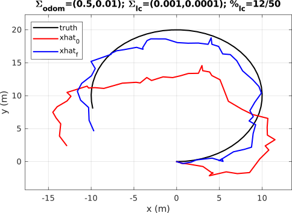
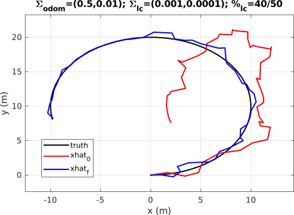
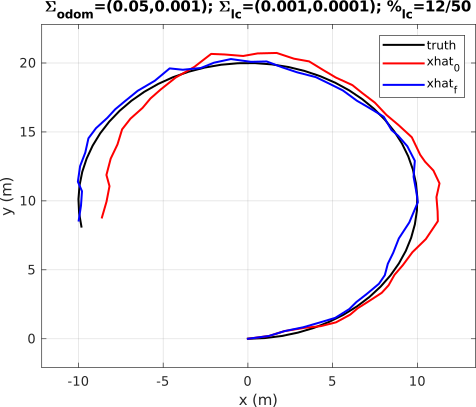
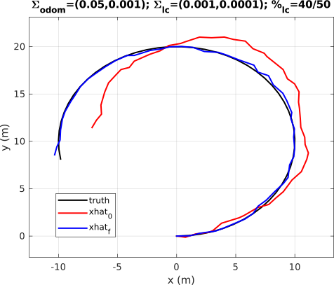
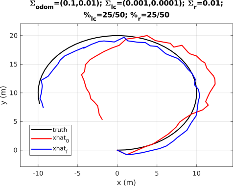
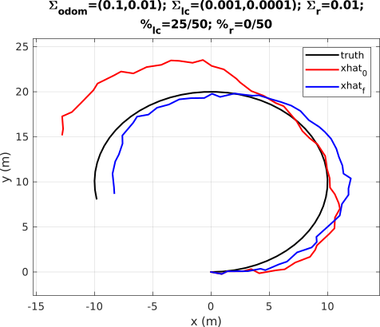
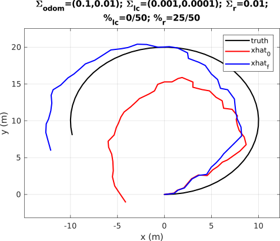
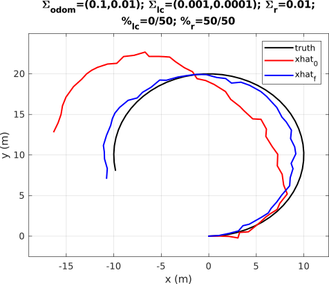

# Ceres Solver Python Tutorial (Linux)

## Ceres Introduction


The Ceres Solver ([](http://ceres-solver.org/)) is Google's powerful and extensive C$++$ optimization library for solving:

  - general unconstrained optimization problems
  - nonlinear least-squares problems with bounds (not equality!) constraints.

The second application is particularly useful for perception, estimation, and control in robotics (perhaps less so for control, depending on how you implement dynamics constraints), where minimizing general nonlinear measurement or tracking residuals sequentially or in batch form is a common theme. This is further facilitated by Ceres' support for optimizing over vector spaces as well as Lie Groups, much like GTSAM. To zoom in on the comparison between the two libraries a bit, here are some relative pros and cons:

^ Ceres Advantages ^ GTSAM Advantages ^
| <WRAP>
  * Supported by Google, not just one research lab
  * Has an awesome [automatic differentiation system](http://ceres-solver.org/automatic_derivatives.html)--no time wasted computing complicated derivatives
  * Generalizes well beyond robotics applications, or even exotic robotics applications that don't yet have pre-programmed tools
</WRAP> | <WRAP>
  * Made specifically for robotics applications, so comes with a lot of useful tools, such as:
  * iSAM2 incremental optimization
  * Marginalization support (e.g., for fixed-lag smoothing)
</WRAP> |

Aside from what's mentioned in the table, GTSAM adopts the helpful [docs](http://deepdive.stanford.edu/inference|factor graph]] modeling paradigm for estimation problems. If desired, Ceres can be used through the definition of factors as well, as will be shown in the examples below. All in all, Ceres is a fine choice for solving optimization-based inference problems, and it's not going away any time soon. Moreover, the [[http://ceres-solver.org/) are thorough and well-made; this tutorial can be thought of as an entry point to give some context to a deep-dive into the documentation.

## Solving Problems with Ceres

At a minimum, a Ceres program for solving [nonlinear least-squares problems](public:autonomy:search-optimization:nonlinear-optimization) requires the following specifications:

  * A **Problem()** object.
  * For every decision variable ("**parameter**") that isn't a vector:
    * Add a **LocalParameterization()** object to the problem using the function **AddParameterBlock()**.
  * For every residual in the problem:
    * Add a **CostFunction()** object (can be thought of as a factor in factor graph lingo) with the relevant parameters using the function **AddResidualBlock()**

See the examples below to get a sense of how these objects and functions are used in practice, particularly in the context of robotics problems.
## Automatic Differentiation in Ceres

One of the main selling points of Ceres is its powerful automatic differentiation system. As covered in the articles on [Nonlinear Least-Squares]], and [[public:autonomy:search-optimization:lie-opt](public:autonomy:search-optimization:nonlinear-optimization]], [[public:autonomy:search-optimization:least-squares#nonlinear), local search requires Jacobian definitions for, at a minimum:

  - The cost function $J$ or residual $r$.
  - The $\oplus$ operator of the parameter vector *if* it exists on a manifold, because of the chain rule.

Thus, any user declaration of a class that inherits from [LocalParameterization](http://ceres-solver.org/nnls_modeling.html#costfunction|CostFunction]] or [[http://ceres-solver.org/nnls_modeling.html#localparameterization) requires the specification of Jacobians. This can get really tedious really fast, which is why Ceres offers auto-diff in the form of two alternative classes to define through templating and inheritance (see the links for details):

  - [AutoDiffCostFunction](http://ceres-solver.org/nnls_modeling.html#_CPPv4N5ceres20AutoDiffCostFunctionE): A templated class that takes as an argument a user-defined "functor" class or struct implementing the residual function.
  - [AutoDiffLocalParameterization](http://ceres-solver.org/nnls_modeling.html#autodifflocalparameterization): A templated class that takes as an argument a user-defined "plus" class or struct implementing the $\oplus$ operator.


## Small Robotics Examples with Ceres (in Python)

Ceres is a C$++$ library, and its speed is certainly dependent on programming in that language. That said, I've found it useful to use Python bindings to learn the library by doing quick experiments solving small-scale robotics problems. 

Below are some examples of Ceres applied to small robotics problems of increasing complexity--they should give a sense of what the library is capable of, and perhaps even facilitate your own prototyping efforts. The Python syntax translates pretty well to C$++$, but of course the [Ceres website](http://ceres-solver.org/tutorial.html) serves as the best C$++$ API reference.

### Linux Setup

If you wish to run/modify the following examples yourself, you’ll need to install these Python packages:

  * numpy
    * For working with vectors and some basic linear algebra.
  * matplotlib
    * For visualization.
  * [ceres_python_bindings](https://github.com/Edwinem/ceres_python_bindings)$^*$
    * Third-party Python bindings for Ceres **< 2.1.0**. Provides the core library API discussed above.
  * [geometry](https://github.com/goromal/geometry)$^*$
    * Python bindings for a C$++$ templated library that implements the chart map operations for $SO(3)$ and $SE(3)$. With this library, the $\oplus$ and $\ominus$ operators are abstracted away into the normal plus and minus operators.
  * [pyceres_factors](https://github.com/goromal/pyceres_factors)$^*$
    * Python bindings for custom cost functions for Ceres that make use of the geometry package above.

$^*$ These are custom Python packages that must be built from source. Follow the build instructions in each link above, then add the *geometry.cpython-*.so* and *pyceres.cpython-*.so* library files to your *PYTHONPATH* environment variable.

If you're a [nixpkgs overlay](https://nixos.org/|Nix]] user, I maintain derivations of these packages in a [[https://github.com/goromal/anixpkgs). Following the README directions, a minimal Nix shell needed to run this tutorial can be spawned with this *shell.nix* file:

```nix

{ pkgs ? import <nixpkgs> {} }: # <nixpkgs> should point to overlay
let
  python-with-my-packages = pkgs.python39.withPackages (p: with p; [
    numpy
    matplotlib
    geometry
    pyceres
    pyceres_factors
  ]);
in
python-with-my-packages.env
```

### Outline

Here's an outline of the incrementally harder problems covered in the coming sections:

### Hello World

This isn't really a robotics problem--it's the Python-wrapped version of Ceres' [hello world tutorial](http://ceres-solver.org/nnls_tutorial.html#hello-world), where the goal is to minimize the cost function

$$J(x)=\frac{1}{2}(10-x)^2.$$

The code:

```python
import PyCeres # Import the Python Bindings
import numpy as np

# The variable to solve for with its initial value.
initial_x = 5.0
x = np.array([initial_x]) # Requires the variable to be in a numpy array

# Here we create the problem as in normal Ceres
problem = PyCeres.Problem()

# Creates the CostFunction. This example uses a C++ wrapped function which 
# returns the Autodiffed cost function used in the C++ example
cost_function = PyCeres.CreateHelloWorldCostFunction()

# Add the costfunction and the parameter numpy array to the problem
problem.AddResidualBlock(cost_function, None, x) 

# Setup the solver options as in normal ceres
options=PyCeres.SolverOptions()
# Ceres enums live in PyCeres and require the enum Type
options.linear_solver_type = PyCeres.LinearSolverType.DENSE_QR
options.minimizer_progress_to_stdout = True
summary = PyCeres.Summary()
# Solve as you would normally
PyCeres.Solve(options, problem, summary)
print(summary.BriefReport() + " \n")
print( "x : " + str(initial_x) + " -> " + str(x) + "\n")
```

The output should look like 

```bash
iter      cost      cost_change  |gradient|   |step|    tr_ratio  tr_radius  ls_iter  iter_time  total_time
   0  1.250000e+01    0.00e+00    5.00e+00   0.00e+00   0.00e+00  1.00e+04        0    6.91e-06    5.70e-05
   1  1.249750e-07    1.25e+01    5.00e-04   5.00e+00   1.00e+00  3.00e+04        1    1.79e-05    1.04e-04
   2  1.388518e-16    1.25e-07    1.67e-08   5.00e-04   1.00e+00  9.00e+04        1    3.10e-06    1.13e-04
Ceres Solver Report: Iterations: 3, Initial cost: 1.250000e+01, Final cost: 1.388518e-16, Termination: CONVERGENCE 

x : 5.0 -> [9.99999998]
```

### 1D SLAM with Range Measurements

In this simplified SLAM problem, a robot is moving along a line, obtaining noisy relative transform measurements $T$ and collecting noisy range measurements $z$ to three different landmarks. The cost function is the sum of all measurement residuals,

$$J(\hat{\boldsymbol{x}},\hat{\boldsymbol{l}})=\sum_{i=1}^8\left(\lvert\lvert T_i-\hat{T}_i\rvert\rvert_{\sigma_T}^2+\sum_{j=1}^3\lvert\lvert z_{i,j}-\hat{z}_{i,j}\rvert\rvert_{\sigma_z}^2\right),$$

for all states $\boldsymbol{x}$ and landmarks $\boldsymbol{l}$ over eight time steps. In this case, since it's in one dimension, the relative transform and range measurements are both computed simply by subtracting two numbers--no need for vector math or local parameterizations. Note the definitions of the Transform1D and Range1D factors as cost objects with provided analytic derivatives. In the future, we'll try defining factors with the help of AutoDiff.

The code:

```python
import PyCeres as ceres
import numpy as np

##
# 1D SLAM with range measurements
##

# "Between Factor" for 1D transform measurement
class Transform1DFactor(ceres.CostFunction):
    # factor initialized with a measurement and an associated variance
    def __init__(self, z, var):
        super().__init__()
        # set size of residuals and parameters
        self.set_num_residuals(1)
        self.set_parameter_block_sizes([1,1])
        # set internal factor variables
        self.transform = z
        self.var = var

    # computes the residual and jacobian from the factor and connected state edges
    def Evaluate(self, parameters, residuals, jacobians):
        # measurement residual compares estimated vs measured transform, scaled by
        # measurement belief
        xi = parameters[0][0]
        xj = parameters[1][0]
        residuals[0] = (self.transform - (xj - xi)) / self.var

        # jacobian of the residual w.r.t. the parameters
        if jacobians != None:
            if jacobians[0] != None:
                jacobians[0][0] = 1.0 / self.var
            if jacobians[1] != None:
                jacobians[1][0] = -1.0 / self.var

        return True

class Range1DFactor(ceres.CostFunction):
    def __init__(self, z, var):
        super().__init__()
        self.set_num_residuals(1)
        self.set_parameter_block_sizes([1,1])
        self.range = z
        self.var = var

    def Evaluate(self, parameters, residuals, jacobians):
        # measurement residual compares estimated vs measured distance to a
        # specific landmark, scaled by measurement belief
        l = parameters[0][0]
        x = parameters[1][0]
        residuals[0] = (self.range - (l - x)) / self.var

        if jacobians != None:
            if jacobians[0] != None:
                jacobians[0][0] = -1.0 / self.var
            if jacobians[1] != None:
                jacobians[1][0] = 1.0 / self.var

        return True

# optimization problem
problem = ceres.Problem()

# true state positions
x = np.array([0., 1., 2., 3., 4., 5., 6., 7.]) 
# true landmark positions
l = np.array([10., 15., 13.])

# faulty landmark position beliefs
lhat = np.array([11., 12., 15.])

# simulate noisy 1D state estimates and landmark measurements that will
# be added to the problem as factors
xhat = np.array([0., 0., 0., 0., 0., 0., 0., 0.])
mu, sigma = 0.0, 1.0 # for normal distribution scalable by variance
Tvar = 1.0e-3 # variance of transform measurement noise
rvar = 1.0e-5 # variance of range measurement noise
for i in range(x.size):
    if i > 0:
        # measured relative transform in 1D 
        That = x[i] - x[i-1] + np.random.normal(mu, sigma, 1).item() * np.sqrt(Tvar)
        # propagate frontend state estimate
        xhat[i] = xhat[i-1] + That
        # add between factor to problem
        problem.AddResidualBlock(Transform1DFactor(That, Tvar), None, xhat[i-1:i], xhat[i:i+1])

    for j in range(l.size):
        # measured range from robot pose i to landmark j
        zbar = l[j] - x[i] + np.random.normal(mu, sigma, 1).item() * np.sqrt(rvar)
        # add range factor to problem
        problem.AddResidualBlock(Range1DFactor(zbar, rvar), None, lhat[j:j+1], xhat[i:i+1])

# initial error, for reference
init_error = np.linalg.norm(x - xhat) + np.linalg.norm(l - lhat)

# set solver options
options = ceres.SolverOptions()
options.max_num_iterations = 25
options.linear_solver_type = ceres.LinearSolverType.DENSE_QR
options.minimizer_progress_to_stdout = True

# solve!
summary = ceres.Summary()
ceres.Solve(options, problem, summary)

# report results
# print(summary.FullReport())
final_error = np.linalg.norm(x - xhat) + np.linalg.norm(l - lhat)
print('Total error of optimized states and landmarks: %f -> %f' % (init_error, final_error))

```

The output should look something *similar* (there's some randomness due to the noise definition) to:

```bash
iter      cost      cost_change  |gradient|   |step|    tr_ratio  tr_radius  ls_iter  iter_time  total_time
   0  5.602067e+11    0.00e+00    2.40e+11   0.00e+00   0.00e+00  1.00e+04        0    5.33e-04    6.07e-04
   1  6.610002e+05    5.60e+11    2.40e+07   3.74e+00   1.00e+00  3.00e+04        1    5.99e-04    1.25e-03
   2  6.553993e+05    5.60e+03    8.00e+02   3.74e-04   1.00e+00  9.00e+04        1    5.58e-04    1.82e-03
Total error of optimized states and landmarks: 3.793793 -> 0.014236
```

### Rotation Averaging with Quaternions and AutoDiff

#### Problem Overview

This example introduces [optimization over the manifold](public:autonomy:search-optimization:lie-opt) of quaternions, as well as auto-differentiation in Ceres. The cost function simply consists of the residual between a single estimated quaternion and $N$ randomly-dispersed quaternions:

$$J(\hat{\boldsymbol{q}})=\sum_{i=1}^N\lvert\lvert \boldsymbol{q}_i\ominus\hat{\boldsymbol{q}}\rvert\rvert_2^2.$$

#### Preliminary Class Definitions

From here on out, the derivatives get annoying enough that we will make exclusive use of AutoDiff to calculate our cost function Jacobians. Because the Python bindings don't provide helpful tools for defining an auto-differentiated cost function in Python, the local parameterization and cost function must be implemented in C$++$ and then wrapped in a Python constructor. Luckily, these C$++$ classes are already implemented for rotations (implemented on the $SO(3)$ manifold) and rigid body transformations (implemented on the $SE(3)$ manifold) in the [Python wrappers](https://github.com/goromal/ceres-factors|ceres-factors]] library with corresponding [[https://github.com/goromal/pyceres_factors). Check out the ceres-factors library to get a sense of how these classes are implemented, if you're interested.

#### Optimization Routine

For the main Ceres solver code, we'll actually allow for the option to *not* define a special LocalParameterization for the quaternion decision variable, just so we can see how it affects the solution. When no LocalParameterization is given, Ceres will assume that the parameter is just a regular vector, and so will perform operations that will inevitably make the parameter leave the manifold it's supposed to be constrained to.

The code:

```python
import numpy as np
from geometry import SO3
import PyCeres as ceres
import PyCeresFactors as factors

##
# Rotation Averaging with Quaternions
##

# If false, will treat the quaternion decision variable as a vector
LOCAL_PARAMETERIZATION = True

# number of rotations to average over
N = 1000
# scaling factor for noisy rotations
noise_scale = 1e-2
# represent the noise as a covariance matrix for the estimator
Q = np.sqrt(noise_scale) * np.eye(3)

# true average quaternion
q = SO3.random()

# initial vector guess for average quaternion
xhat = SO3.identity().array()

# optimization problem
problem = ceres.Problem()

# if using local parameterization, add it to the problem
if LOCAL_PARAMETERIZATION:
    problem.AddParameterBlock(xhat, 4, factors.SO3Parameterization())

# create noisy rotations around the true average and add to problem as 
# measurement residuals
for i in range(N):
    sample = (q + np.random.random(3) * noise_scale).array()
    problem.AddResidualBlock(factors.SO3Factor(sample, Q),
                             None,
                             xhat)

# set solver options
options = ceres.SolverOptions()
options.max_num_iterations = 25
options.linear_solver_type = ceres.LinearSolverType.DENSE_QR
options.minimizer_progress_to_stdout = True

# solve!
summary = ceres.Summary()
ceres.Solve(options, problem, summary)

# report results
q_hat = SO3(xhat)
print('q:', q)
print('q_hat:', q_hat)
if not LOCAL_PARAMETERIZATION:
    print('q_hat (normalized):', q_hat.normalized())

```

#### Results


With LOCAL_PARAMETERIZATION set to True, the output will look something like this:

```bash
iter      cost      cost_change  |gradient|   |step|    tr_ratio  tr_radius  ls_iter  iter_time  total_time
   0  1.613744e+05    0.00e+00    6.62e-01   0.00e+00   0.00e+00  1.00e+04        0    2.29e-04    3.36e-04
   1  1.262180e+00    1.61e+05    1.03e+00   8.68e-01   1.00e+00  3.00e+04        1    3.84e-04    7.44e-04
   2  1.259806e+00    2.37e-03    3.07e-04   1.09e-04   1.00e+00  9.00e+04        1    3.46e-04    1.10e-03
q: SO(3): [ 0.625178, -0.194097i, 0.520264j, 0.548456k]
q_hat: SO(3): [ 0.622974, -0.192598i, 0.523643j, 0.548277k]
```

If LOCAL_PARAMETERIZATION is set to False, then an output similar to the following will be shown. Note that quaternion normalization is needed to actually return a valid answer. It even takes more iterations to converge!

```bash
iter      cost      cost_change  |gradient|   |step|    tr_ratio  tr_radius  ls_iter  iter_time  total_time
   0  1.613945e+05    0.00e+00    2.52e+05   0.00e+00   0.00e+00  1.00e+04        0    1.97e-04    3.16e-04
   1  5.546311e+03    1.56e+05    3.31e+04   8.98e-01   9.66e-01  3.00e+04        1    4.31e-04    7.74e-04
   2  1.055270e+01    5.54e+03    1.65e+03   2.33e-01   9.98e-01  9.00e+04        1    3.39e-04    1.12e-03
   3  1.238904e+00    9.31e+00    8.84e-01   8.88e-03   1.00e+00  2.70e+05        1    3.20e-04    1.45e-03
   4  1.238901e+00    2.69e-06    4.85e-06   4.78e-06   1.00e+00  8.10e+05        1    3.10e-04    1.76e-03
q: SO(3): [ 0.625178, -0.194097i, 0.520264j, 0.548456k]
q_hat: SO(3): [ 0.808827, -0.250154i, 0.680017j, 0.711829k]
q_hat (normalized): SO(3): [ 0.622930, -0.192660i, 0.523726j, 0.548226k]
```

### Pose Graph SLAM

#### Problem Overview

The pose graph SLAM problem aims to minimize the measurement error between measured and actual relative poses:

$$J=\sum_{(i,j)\in\mathcal{E}}\lvert\lvert \hat{\boldsymbol{R}}_{j}\ominus\hat{\boldsymbol{R}}_{i}\boldsymbol{R}_{ij}\rvert\rvert_{F}^{2}+\lvert\lvert \hat{\boldsymbol{t}}_{j}-\hat{\boldsymbol{t}}_{i}-\hat{\boldsymbol{R}}_{i}\boldsymbol{t}_{ij}\rvert\rvert_{2}^{2},$$

where the edges $\mathcal{E}$ in the pose graph encompass both odometry and loop closure relative pose measurements. With $\boldsymbol{T}\in SE(3)$ and adding in covariance matrix weighting, the above can be re-written concisely as

$$J=\sum_{(i,j)\in\mathcal{E}}\lvert\lvert \left(\hat{\boldsymbol{T}}_{i}^{-1}\hat{\boldsymbol{T}}_j\right)\ominus\boldsymbol{T}_{ij}\rvert\rvert_{\boldsymbol{\Sigma}}^{2}.$$

/*#### Preliminary Class Definitions

To perform full-on pose graph optimization with Ceres, the following definitions are needed:

  - An $SE(3)$ group implementation that overloads the +/- operators with $\oplus$/$\ominus$. We will use the **SE3** class from Sophus.
  - An AutoDiff local parameterization for the $SE(3)$ group, since Ceres doesn't ship with one.
  - An AutoDiff cost function/factor for the residual obtained by subtracting a measured relative $SE(3)$ transform and the current estimated relative $SE(3)$ transform, i.e., an edge in the pose graph.

First, some convenience functions for converting to/from the SE3 type:

```cpp
// cSE3 conversion functions: to/from pointer/vector
template<typename T>
void cSE3convert(const T* data, Sophus::SE3<T>& X) {
  X = Sophus::SE3<T>(Eigen::Quaternion<T>(data+3),
                     Eigen::Map<const Eigen::Matrix<T,3,1>>(data));
}
template<typename T>
void cSE3convert(const Eigen::Matrix<T,7,1> &Xvec, Sophus::SE3<T>& X) {
  X = Sophus::SE3<T>(Eigen::Quaternion<T>(Xvec.data()+3),
                     Eigen::Map<const Eigen::Matrix<T,3,1>>(Xvec.data()));
}
template<typename T>
void cSE3convert(const Sophus::SE3<T>& X, Eigen::Matrix<T,7,1> &Xvec) {
  Xvec.template block<3,1>(0,0) = Eigen::Matrix<T,3,1>(X.translation().data());
  Xvec.template block<4,1>(3,0) = Eigen::Matrix<T,4,1>(X.so3().data());
}
```

The definition for (2) follows, which functions a lot like Ceres' built-in EigenQuaternionLocalParameterization class--just with an added translation component:

```cpp
* AutoDiff local parameterization for the compact SE3 pose [t q] object. 
* The boxplus operator informs Ceres how the manifold evolves and also  
* allows for the calculation of derivatives.
struct cSE3Plus {
  * boxplus operator for both doubles and jets
  template<typename T>
  bool operator()(const T* x, const T* delta, T* x_plus_delta) const
  {
    * capture argument memory
    Sophus::SE3<T> X;
    cSE3convert(x, X);
    Eigen::Map<const Eigen::Matrix<T, 6, 1>> dX(delta);
    Eigen::Map<Eigen::Matrix<T, 7, 1>>       Yvec(x_plus_delta);

    * increment pose using the exponential map
    Sophus::SE3<T> Exp_dX = Sophus::SE3<T>::exp(dX);
    Sophus::SE3<T> Y = X * Exp_dX;

    * assign SE3 coefficients to compact vector
    Eigen::Matrix<T,7,1> YvecCoef;
    cSE3convert(Y, YvecCoef);
    Yvec = YvecCoef;

    return true;
  }
  
  * local parameterization generator--ONLY FOR PYTHON WRAPPER
  static ceres::LocalParameterization *Create() {
    return new ceres::AutoDiffLocalParameterization<cSE3Plus,
                                                    7,
                                                    6>(new cSE3Plus);
  }
};
```

The definition for (3) also looks a lot like the Quaternion-based cost function implemented for rotation averaging, again with an added translation component. Also note the addition of the inverse covariance matrix for weighting residuals:

```cpp
* AutoDiff cost function (factor) for the difference between a measured 3D
* relative transform, Xij = (tij_, qij_), and the relative transform between two  
* estimated poses, Xi_hat and Xj_hat. Weighted by measurement covariance, Qij_.
class cSE3Functor
{
public:
EIGEN_MAKE_ALIGNED_OPERATOR_NEW
  * store measured relative pose and inverted covariance matrix
  cSE3Functor(Eigen::Matrix<double,7,1> &Xij_vec, Eigen::Matrix<double,6,6> &Qij)
  {
    Sophus::SE3<double> Xij;
    cSE3convert(Xij_vec, Xij);
    Xij_inv_ = Xij.inverse();
    Qij_inv_ = Qij.inverse();
  }

  * templated residual definition for both doubles and jets
  * basically a weighted implementation of boxminus using Eigen templated types
  template<typename T>
  bool operator()(const T* _Xi_hat, const T* _Xj_hat, T* _res) const
  {
    * assign memory to usable objects
    Sophus::SE3<T> Xi_hat, Xj_hat;
    cSE3convert(_Xi_hat, Xi_hat);
    cSE3convert(_Xj_hat, Xj_hat);
    Eigen::Map<Eigen::Matrix<T,6,1>> r(_res);

    * compute current estimated relative pose
    const Sophus::SE3<T> Xij_hat = Xi_hat.inverse() * Xj_hat;

    * compute residual via boxminus (i.e., the logarithmic map of the error pose)
    * weight with inverse covariance
    r = Qij_inv_.cast<T>() * (Xij_inv_.cast<T>() * Xij_hat).log();        

    return true;
  }

  // cost function generator--ONLY FOR PYTHON WRAPPER
  static ceres::CostFunction *Create(Eigen::Matrix<double,7,1> &Xij, Eigen::Matrix<double,6,6> &Qij) {
    return new ceres::AutoDiffCostFunction<cSE3Functor,
                                           6,
                                           7,
                                           7>(new cSE3Functor(Xij, Qij));
  }

private:
  Sophus::SE3<double> Xij_inv_;
  Eigen::Matrix<double,6,6> Qij_inv_;
};
```

Note that both (2) and (3) take advantage of Sophus' implemented chart operations for $SE(3)$. Further, auto-differentiation is possible because of Sophus' templated classes, modeled after Eigen's templated classes.*/

/*Note that because we defined our Transform3D object in Python, we ended up implementing both $\oplus$ and $\ominus$ twice--once in the class definition and once in the parameterization and factor definitions. Maybe implementing them in both languages was informative, but a smarter thing to do in the future would be to define the base Lie Group class in C$++$ (or even utilize some pre-written classes like the ones from the [Sophus](https://github.com/strasdat/Sophus) library) and then utilize its overloaded operator directly for shorter parameterization and factor definitions. Finally, if you paid very close attention, you'll notice that I made a **slight but important error** in my $\oplus$ and $\ominus$ implementations by not adding a rotation matrix term to the translation vector operations. Again, an error that could be avoided by using classes provided by other libraries! However, as we'll see in the optimization routine, because my $SE(3)$ implementation was consistent throughout, we can still extract a minimizing trajectory. I guess we can pretend that relative translation measurements were all given in the global frame and call it good...*/

#### Optimization Routine

Putting everything together, we simulate a simple robot moving in a circle, obtaining noisy odometry and loop closure measurements as it moves along. These noisy measurements are used to formulate and solve the pose graph optimization problem:

```python
import numpy as np
import matplotlib.pyplot as plt
from geometry import SE3
import PyCeres as ceres
import PyCeresFactors as factors

##
# Pose Graph SLAM
##

# odom, loop closure covariances (linear, angular)
odom_cov_vals = (0.5, 0.01)
lc_cov_vals = (0.001, 0.0001)

# simulation parameters
num_steps = 50
num_lc = 12 # number of loop closures to insert

# delta pose/odometry between successive nodes in graph (tangent space representation as a local perturbation)
dx = np.array([1.,0.,0.,0.,0.,0.1])

# odometry covariance
odom_cov = np.eye(6)
odom_cov[:3,:3] *= odom_cov_vals[0] # delta translation noise
odom_cov[3:,3:] *= odom_cov_vals[1] # delta rotation noise
odom_cov_sqrt = np.linalg.cholesky(odom_cov)

# loop closure covariance
lc_cov = np.eye(6)
lc_cov[:3,:3] *= lc_cov_vals[0] # relative translation noise
lc_cov[3:,3:] *= lc_cov_vals[1] # relative rotation noise
lc_cov_sqrt = np.linalg.cholesky(lc_cov)

# truth/estimate buffers
x = list()
xhat = list() # in Python, need to keep parameter arrays separate to prevent memory aliasing

# determine which pose indices will have loop closures between them
loop_closures = list()
for l in range(num_lc):
    i = np.random.randint(low=0, high=num_steps-1)
    j = np.random.randint(low=0, high=num_steps-2)
    if j == i:
        j = num_steps-1
    loop_closures.append((i,j))

# optimization problem
problem = ceres.Problem()

# create odometry measurements
for k in range(num_steps):
    if k == 0:
        # starting pose
        xhat.append(SE3.identity().array())
        x.append(SE3.identity().array())

        # add (fixed) prior to the graph
        problem.AddParameterBlock(xhat[k], 7, factors.SE3Parameterization())
        problem.SetParameterBlockConstant(xhat[k])
    else:
        # time step endpoints
        i = k-1
        j = k

        # simulate system
        x.append((SE3(x[i]) + dx).array())

        # create noisy front-end measurement (constrained to the horizontal plane)
        dx_noise = odom_cov_sqrt.dot(np.random.normal(np.zeros(6), np.ones(6), (6,)))
        dx_noise[2] = dx_noise[3] = dx_noise[4] = 0.
        dxhat = SE3.Exp(dx + dx_noise)
        xhat.append((SE3(xhat[i]) * dxhat).array())

        # add relative measurement to the problem as a between factor (with appropriate parameterization)
        problem.AddParameterBlock(xhat[j], 7, factors.SE3Parameterization())
        problem.AddResidualBlock(factors.RelSE3Factor(dxhat.array(), odom_cov), None, xhat[i], xhat[j])

# create loop closure measurements
for l in range(num_lc):
    i = loop_closures[l][0]
    j = loop_closures[l][1]

    # noise-less loop closure measurement
    xi = SE3(x[i])
    xj = SE3(x[j])
    xij = xi.inverse() * xj

    # add noise to loop closure measurement (constrained to the horizontal plane)
    dx_noise = lc_cov_sqrt.dot(np.random.normal(np.zeros(6), np.ones(6), (6,)))
    dx_noise[2] = dx_noise[3] = dx_noise[4] = 0.
    dx_meas = xij + dx_noise

    # add relative measurement to the problem as a between factor
    problem.AddResidualBlock(factors.RelSE3Factor(dx_meas.array(), lc_cov), None, xhat[i], xhat[j])

# initial error, for reference
prev_err = 0.
x1_true = list()
x2_true = list()
x1_init = list()
x2_init = list()
for k in range(num_steps):
    prev_err += 1.0/6.0*np.linalg.norm(x[k] - xhat[k])**2
    x1_true.append(x[k][0])
    x2_true.append(x[k][1])
    x1_init.append(xhat[k][0])
    x2_init.append(xhat[k][1])
prev_err /= num_steps

# set solver options
options = ceres.SolverOptions()
options.max_num_iterations = 25
options.linear_solver_type = ceres.LinearSolverType.SPARSE_NORMAL_CHOLESKY
options.minimizer_progress_to_stdout = True

# solve!
summary = ceres.Summary()
ceres.Solve(options, problem, summary)

# report results
post_err = 0.
x1_final = list()
x2_final = list()
for k in range(num_steps):
    post_err += 1.0/6.0*np.linalg.norm(x[k] - xhat[k])**2
    x1_final.append(xhat[k][0])
    x2_final.append(xhat[k][1])
post_err /= num_steps
print('Average error of optimized poses: %f -> %f' % (prev_err, post_err))

# plot results
fig, ax = plt.subplots()
ax.plot(x1_true, x2_true, color='black', label='truth')
ax.plot(x1_init, x2_init, color='red', label='xhat_0')
ax.plot(x1_final, x2_final, color='blue', label='xhat_f')
ax.set_title('Pose Graph Optimization Example')
ax.set_xlabel('x (m)')
ax.set_ylabel('y (m)')
ax.legend()
ax.grid()
plt.show()
```

Viewing the results from the command line will give something like this:

```bash
iter      cost      cost_change  |gradient|   |step|    tr_ratio  tr_radius  ls_iter  iter_time  total_time
   0  2.643133e+09    0.00e+00    1.91e+00   0.00e+00   0.00e+00  1.00e+04        0    1.62e-03    2.14e-03
   1  2.872315e+08    2.36e+09    2.86e+02   1.03e+02   8.95e-01  1.97e+04        1    1.98e-03    4.16e-03
   2  9.150302e+05    2.86e+08    4.99e+02   3.11e+01   9.97e-01  5.90e+04        1    1.51e-03    5.69e-03
   3  1.600187e+04    8.99e+05    9.67e+01   5.52e+00   1.00e+00  1.77e+05        1    1.59e-03    7.29e-03
   4  1.536517e+04    6.37e+02    2.95e+01   5.41e+00   1.00e+00  5.31e+05        1    1.48e-03    8.78e-03
   5  1.530853e+04    5.66e+01    3.66e+00   3.38e+00   1.00e+00  1.59e+06        1    1.39e-03    1.02e-02
   6  1.530598e+04    2.55e+00    6.84e-01   8.33e-01   1.00e+00  4.78e+06        1    1.33e-03    1.15e-02
   7  1.530597e+04    1.73e-02    4.78e-02   7.25e-02   1.00e+00  1.43e+07        1    1.31e-03    1.28e-02
Average error of optimized poses: 31.432182 -> 0.040357
```

and a quick plot of the trajectories for several covariance and simulation parameter combinations gives a more intuitive evaluative measure:









### Pose Graph SLAM with Range Measurements

#### Problem Overview

For this final example, we add point-to-point range measurements for random pose pairs along the trajectory:

$$J=\sum_{(i,j)\in\mathcal{E}}\lvert\lvert \left(\hat{\boldsymbol{T}}_{i}^{-1}\hat{\boldsymbol{T}}_j\right)\ominus\boldsymbol{T}_{ij}\rvert\rvert_{\boldsymbol{\Sigma}}^{2}+\lvert\lvert \lvert\lvert \hat{\boldsymbol{t}}_{j}-\hat{\boldsymbol{t}}_{i}\rvert\rvert_2-r_{ij}\rvert\rvert_{\boldsymbol{\Sigma}}^2,$$

which isn't very realistic, but can be informative about the feasibility of a larger problem of utilizing inter-agent range measurements in a multi-agent SLAM scenario to reduce drift without relying heavily on inter-agent loop closure detection and communication. The *PyCeresFactors.RangeFactor* function wrapper implements this custom cost function.

#### Optimization Routine

The Python code is very similar to the pure pose graph problem--just with added range measurement simulation and corresponding range factors:

```python
import numpy as np
import matplotlib.pyplot as plt
from geometry import SE3
import PyCeres as ceres
import PyCeresFactors as factors

##
# Pose Graph SLAM with Range Measurements
##

# odom, loop closure covariances (linear, angular)
odom_cov_vals = (0.5, 0.01)
lc_cov_vals = (0.001, 0.0001)

# range variance
range_cov = 0.01

# simulation parameters
num_steps = 50
num_lc = 12
num_range = 12

# delta pose/odometry between successive nodes in graph (tangent space representation as a local perturbation)
dx = np.array([1.,0.,0.,0.,0.,0.1])

# odometry covariance
odom_cov = np.eye(6)
odom_cov[:3,:3] *= odom_cov_vals[0] # delta translation noise
odom_cov[3:,3:] *= odom_cov_vals[1] # delta rotation noise
odom_cov_sqrt = np.linalg.cholesky(odom_cov)

# loop closure covariance
lc_cov = np.eye(6)
lc_cov[:3,:3] *= lc_cov_vals[0] # relative translation noise
lc_cov[3:,3:] *= lc_cov_vals[1] # relative rotation noise
lc_cov_sqrt = np.linalg.cholesky(lc_cov)

# range covariance
range_cov_sqrt = np.sqrt(range_cov)

# truth/estimate buffers
x = list()
xhat = list() # in Python, need to keep parameter arrays separate to prevent memory aliasing

# determine which pose indices will have loop closures between them
loop_closures = list()
for l in range(num_lc):
    i = np.random.randint(low=0, high=num_steps-1)
    j = np.random.randint(low=0, high=num_steps-2)
    if j == i:
        j = num_steps-1
    loop_closures.append((i,j))

# determine which pose indices will have range measurements between them
range_measurements = list()
for l in range(num_range):
    i = np.random.randint(low=0, high=num_steps-1)
    j = np.random.randint(low=0, high=num_steps-2)
    if j == i:
        j = num_steps-1
    range_measurements.append((i,j))

# optimization problem
problem = ceres.Problem()

# create odometry measurements
for k in range(num_steps):
    if k == 0:
        # starting pose
        xhat.append(SE3.identity().array())
        x.append(SE3.identity().array())

        # add (fixed) prior to the graph
        problem.AddParameterBlock(xhat[k], 7, factors.SE3Parameterization())
        problem.SetParameterBlockConstant(xhat[k])
    else:
        # time step endpoints
        i = k-1
        j = k

        # simulate system
        x.append((SE3(x[i]) + dx).array())

        # create noisy front-end measurement (constrained to the horizontal plane)
        dx_noise = odom_cov_sqrt.dot(np.random.normal(np.zeros(6), np.ones(6), (6,)))
        dx_noise[2] = dx_noise[3] = dx_noise[4] = 0.
        dxhat = SE3.Exp(dx + dx_noise)
        xhat.append((SE3(xhat[i]) * dxhat).array())

        # add relative measurement to the problem as a between factor (with appropriate parameterization)
        problem.AddParameterBlock(xhat[j], 7, factors.SE3Parameterization())
        problem.AddResidualBlock(factors.RelSE3Factor(dxhat.array(), odom_cov), None, xhat[i], xhat[j])

# create loop closure measurements
for l in range(num_lc):
    i = loop_closures[l][0]
    j = loop_closures[l][1]

    # noise-less loop closure measurement
    xi = SE3(x[i])
    xj = SE3(x[j])
    xij = xi.inverse() * xj

    # add noise to loop closure measurement (constrained to the horizontal plane)
    dx_noise = lc_cov_sqrt.dot(np.random.normal(np.zeros(6), np.ones(6), (6,)))
    dx_noise[2] = dx_noise[3] = dx_noise[4] = 0.
    dx_meas = xij + dx_noise

    # add relative measurement to the problem as a between factor
    problem.AddResidualBlock(factors.RelSE3Factor(dx_meas.array(), lc_cov), None, xhat[i], xhat[j])

# create range measurements
for r in range(num_range):
    i = range_measurements[r][0]
    j = range_measurements[r][1]

    # noise-less range measurement
    ti = x[i][:3]
    tj = x[j][:3]
    rij = np.linalg.norm(tj - ti)

    # add noise to range measurement
    r_noise = range_cov_sqrt * np.random.normal(0.0, 1.0, 1).item()

    # add range measurement to the problem as a range factor
    problem.AddResidualBlock(factors.RangeFactor(rij, range_cov), None, xhat[i], xhat[j])

# initial error, for reference
prev_err = 0.
x1_true = list()
x2_true = list()
x1_init = list()
x2_init = list()
for k in range(num_steps):
    prev_err += 1.0/6.0*np.linalg.norm(x[k] - xhat[k])**2
    x1_true.append(x[k][0])
    x2_true.append(x[k][1])
    x1_init.append(xhat[k][0])
    x2_init.append(xhat[k][1])
prev_err /= num_steps

# set solver options
options = ceres.SolverOptions()
options.max_num_iterations = 25
options.linear_solver_type = ceres.LinearSolverType.SPARSE_NORMAL_CHOLESKY
options.minimizer_progress_to_stdout = True

# solve!
summary = ceres.Summary()
ceres.Solve(options, problem, summary)

# report results
post_err = 0.
x1_final = list()
x2_final = list()
for k in range(num_steps):
    post_err += 1.0/6.0*np.linalg.norm(x[k] - xhat[k])**2
    x1_final.append(xhat[k][0])
    x2_final.append(xhat[k][1])
post_err /= num_steps
print('Average error of optimized poses: %f -> %f' % (prev_err, post_err))

# plot results
fig, ax = plt.subplots()
ax.plot(x1_true, x2_true, color='black', label='truth')
ax.plot(x1_init, x2_init, color='red', label='xhat_0')
ax.plot(x1_final, x2_final, color='blue', label='xhat_f')
ax.set_title('PGO + Range Example')
ax.set_xlabel('x (m)')
ax.set_ylabel('y (m)')
ax.legend()
ax.grid()
plt.show()
```

#### Results

Some sample output as a sanity check:

```bash
iter      cost      cost_change  |gradient|   |step|    tr_ratio  tr_radius  ls_iter  iter_time  total_time
   0  2.189067e+08    0.00e+00    5.24e+04   0.00e+00   0.00e+00  1.00e+04        0    7.62e-04    1.10e-03
   1  1.157768e+06    2.18e+08    6.49e+03   1.56e+01   9.95e-01  3.00e+04        1    1.29e-03    2.42e-03
   2  2.895435e+03    1.15e+06    2.23e+03   3.65e+00   9.98e-01  9.00e+04        1    1.19e-03    3.62e-03
   3  9.127433e+02    1.98e+03    2.32e+02   2.79e+00   9.92e-01  2.70e+05        1    1.21e-03    4.85e-03
   4  8.610937e+02    5.16e+01    2.89e+02   3.53e+00   7.24e-01  2.97e+05        1    1.19e-03    6.05e-03
   5  8.271397e+02    3.40e+01    8.19e+01   2.52e+00   9.70e-01  8.90e+05        1    1.17e-03    7.23e-03
   6  8.133719e+02    1.38e+01    8.09e+01   4.37e+00   9.41e-01  2.67e+06        1    1.18e-03    8.43e-03
   7  8.049370e+02    8.43e+00    1.10e+02   5.30e+00   9.18e-01  6.42e+06        1    1.17e-03    9.60e-03
   8  8.025589e+02    2.38e+00    4.76e+01   2.99e+00   9.59e-01  1.93e+07        1    1.32e-03    1.09e-02
   9  8.023315e+02    2.27e-01    5.95e+00   8.69e-01   1.00e+00  5.78e+07        1    1.82e-03    1.28e-02
  10  8.023281e+02    3.40e-03    1.90e-01   1.04e-01   1.02e+00  1.73e+08        1    1.54e-03    1.43e-02
Average error of optimized poses: 2.014479 -> 0.186329
```

And some plots, which are more interesting to look at. It looks like range measurements can indeed help keep front-end drift under control, despite the fact that they only provide 1D information embedded in 3D space!









### Additional Examples

  * [[public:autonomy:implementation:opt-libs:ceres-rangebearing]]
