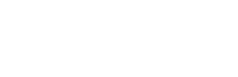

# The Transport Theorem and "Fictitious Forces"

## Newton's Laws and Inertial Reference Frames

[Newton's Laws of Motion](https://en.wikipedia.org/wiki/Newton%27s_laws_of_motion)

Newton's second law is usually introduced to engineering students (or the curious general public) in the following form:

$$\sum\mathbf{F}=m\mathbf{a}=m\frac{d\mathbf{v}}{dt},$$

which is all well and good, except that it could be re-written to more precisely communicate an oft-unspoken precondition implied by Newton's first law: that the "observer" (or the one noting the net forces and their effects) must be observing from and *inertial reference frame.* An inertial reference frame is a reference frame that is not accelerating (including through rotation). To make this precondition explicit, we can denote \\(W\\) ("World") as the canonical inertial frame for our applications and re-write the second law as

$$\sum\mathbf{F}^W=m\mathbf{a}^W=m\frac{d\mathbf{v}^W}{dt^W},$$

where \\(\frac{d\square^W}{dt^W}\\) is the simple derivative we all know and love, lending itself to e.g., standard numerical differentiation techniques:

$$\frac{d\square^W}{dt^W}=\lim_{\Delta t\rightarrow 0}\frac{\square(t+\Delta t)-\square(t)}{\Delta t}.$$

Here we chose to express \\(\mathbf{F}^W\\) in the inertial frame, but the inertial observer precondition does not actually constrain us to do so. We can denote \\(B\\) as a reference frame that's rotating with respect to \\(W\\) as defined by the arbitrary time-dependent function \\(\mathbf{\omega}^{B}_{B/W}(t)\\). And we can re-express Newton's second law for forces expressed in \\(B\\):

$$\sum\mathbf{F}^B=m\mathbf{a}^B=m\frac{d\mathbf{v}^B}{dt^W},$$

but what does \\(\frac{d\mathbf{v}^B}{dt^W}\\) mean? It's an inertial observer's account of the total derivative of an evolving vector expressed in a different, perhaps non-inertial reference frame. It's certainly not a straightforward derivative, unlike its all-inertial-frame counterpart.

## The Transport Theorem

The transport theorem specifies how to calculate \\(\frac{d\square^B}{dt^W}\\) when \\(B\\) is a rotating reference frame described by \\(\mathbf{\omega}^{B}_{B/W}(t)\\):

> $$\frac{d\square^B}{dt^W}=\frac{d\square^B}{dt^B}+\mathbf{\omega}^{B}_{B/W}\times\square^B.$$

In other words, an inertial observer's account of the time derivative is equal to a non-inertial observer's naive account of the time derivative (\\(\frac{d\square^B}{dt^B}\\)) plus the inertial-frame accelerations that are implied by the rotating reference frame (\\(\mathbf{\omega}^{B}_{B/W}\times\square^B\\)). The same logic applies to linearly accelerating reference frames, which would add another corrective term to the equation above to account for the acceleration implied by a linearly accelerating reference frame.

Newton's second law can thus be fully written out for vectors expressed in rotating reference frames as

> $$\sum\mathbf{F}^B=m\mathbf{a}^B=m\frac{d\mathbf{v}^B}{dt^W}=m\left(\frac{d\mathbf{v}^B}{dt^B}+\mathbf{\omega}^{B}_{B/W}\times\mathbf{v}^B\right).$$

## Fictitious Forces from Rotating Reference Frames

### Application of the Transport Theorem from Velocity

The main reason why Newton's second law has the inertial observer precondition is that non-inertial reference frames introduce [fictitious forces](https://en.wikipedia.org/wiki/Rotating_reference_frame#Fictitious_forces) (e.g., centrifugal, Coriolis, and Euler forces) that break Newton's first law. Luckily, we don't have to keep track of all of the details of these fictitious forces, because the transport theorem accurately describes all fictitious forces when they arise.

There is some nuance when using the transport theorem to calculate fictitious forces, however, and it's important to understand those nuances to avoid getting confused. The simplest example to illustrate this nuance is a point mass expressed in a non-inertial reference frame that's rotating in a 2D plane. There are two ways to conceptualize this problem. The first way (scenario **A**, left in the figure below) is to picture the point mass being propelled through space while anchored to the origin of the rotating reference frame by a massless string. The second way (scenario **B**, right in the figure below) is to remove the string, though the reference frame is still rotating in the same manner.

Some relevant observations about both scenarios:

- Scenario **A** has *actual forces* acting on the point mass (coming from the tension in the string) whereas scenario **B** has no real forces acting anywhere.
- The point mass in scenario **A** looks like it's being acted on by a force to an inertial observer, whereas the point mass in scenario **B** looks like it's being acted on by a force only to an observer who lives within the rotating reference frame.
- The actual force in scenario **A** is *equal and opposite* to the fictitious force in scenario **B**, assuming that the rotational speeds and velocities are equal between the two.

Observations 1-3 highlight the generalizable differences between "real" and "fictitious" forces. For scenarios **A** and **B**, the real and fictitious forces are the centripetal and centrifugal force, respectively. A centripetal force is a real force; it's the force the string is imposing on the mass to *make* it rotate instead of move in a straight line as it would normally do, and this is observable to a non-rotating, inertial observer. The centrifugal force is imaginary, apparent only to an observer who's rotating with the non-inertial reference frame; an inertial observer can easily see that the point mass is not actually veering unnaturally from its original trajectory. The centripetal and centrifugal forces are equal and opposite, which is why the centrifugal force is often referred to as a "reaction force" in scenario **A**.

The transport theorem can (and should) be used to understand and calculate both types of forces. Picture a point mass \\(m\\) no longer confined to the plane, but moving within an arbitrarily rotating reference frame \\(B\\) in 3D space. We can do all of our analysis with vectors expressed in the \\(B\\) frame, as those quantities are often more readily measurable.

Applying scenario **A**-like conditions to this general case, we picture the point mass moving with a scalar constant velocity \\(v\\) as it is constrained by some non-zero, *real* net force \\(\sum\mathbf{F}^B\\) (whatever it may be--another massless string?) to rotate rigidly with the same angular velocity as \\(B\\). We thus know the following:

- \\(\sum\mathbf{F}^B\neq 0\\) (what is it?)
- To an observer who lives in \\(B\\), the point mass's velocity is not changing over time: \\(\frac{d\mathbf{v}^B}{dt^B}=0\\)

which gives, when applying the transport theorem:

> $$\sum\mathbf{F}^B=m\left(\mathbf{\omega}_{B/W}^B\times\mathbf{v}^B\right).$$

This gives us a way to calculate centripetal force for the generalized scenario **A**.

Scenario **B** is often a more common thing to worry about in the generalized case, especially considering that on the planet Earth we are not inertial observers, but rather observers rigidly attached to a rapidly rotating reference frame. Thus, we're beholden to observe imaginary forces like centrifugal and Coriolis forces--can we calculate the acceleration effects of these fake but convincing-looking forces according to our non-inertial vantage point? For the generalized scenario **B**, the following is true:

- There is no actual force acting: \\(\sum\mathbf{F}^B= 0\\)
- Because of the above, to an *inertial* observer, the point mass's velocity is not changing over time: \\(\frac{d\mathbf{v}^B}{dt^W}=0\\)

which gives, when applying the transport theorem and moving some terms to the other side of the equals sign:

> $$\frac{d\mathbf{v}^B}{dt^B}=-\mathbf{\omega}_{B/W}^B\times\mathbf{v}^B.$$

This gives us a way to calculate apparent accelerations from fake forces resulting from observing from a rotating reference frame, including the famous centrifugal and Coriolis forces we observe on Earth.

The transport theorem is a powerful paradigm through which to conceptualize both real and fictitious forces that arise in rotating reference frames such as our own spinning planet.

### Caveat: Double Application of the Transport Theorem

The previous section wraps up all fictitious forces into one concise equation above, but an implicit assumption was made for the sake of simplicity: we took \\(\mathbf{v}^B\\) for granted--that is, we just thought of it as some time-varying vector quantity, but *didn't dive into any special effects that a rotating reference frame might have on constraining the apparent nature of such a velocity*. Thus, we obscured the explicit characterization of the fictitious centrifugal force (which is partially dependent on position, a quantity that's obscured when you take a velocity as a given, un-characterized term in your equation), focusing instead on Coriolis effects, which are dependent on velocity and rotation alone.

We can amend this obscurity by not taking \\(\mathbf{v}^B\\) for granted and instead starting our analysis with the most fundamental quantity, position \\(\mathbf{p}^B_{P/B}(t)\\). \\(P\\) is denoted as the body-fixed reference frame of the particle, and \\(\mathbf{p}\\) gives the position of the origin of \\(P\\) relative to the origin of the rotating reference frame \\(B\\). Instead of taking velocity for granted, we will take position for granted as an arbitrarily time-varying quantity. This is okay, because there are no physical states "hidden behind" position, unlike with velocity--position is the most fundamental unit for translational mechanics (same as with attitude for rotational mechanics). This perspective will allow for maximal observability of all fictitious forces resulting from a rotating, non-inertial observer of an arbitrarily-moving particle; we just need to apply the transport theorem twice instead of once in order to get to the acceleration term in Newton's second law!

We place ourselves once again in the perspective of a rotating observer and apply the transport theorem a first time, which gets us to a first-order differential equation:

$$\mathbf{v}^B_{P/B}=\frac{d\mathbf{p}^B_{P/B}}{dt^W}=\frac{d\mathbf{p}^B_{P/B}}{dt^B}+\mathbf{\omega}^B_{B/W}\times\mathbf{p}^B_{P/B}.$$

Now we apply the transport theorem a second time to obtain acceleration. We need the inertial derivative of velocity, \\(\frac{d\mathbf{v}^B_{P/B}}{dt^W}\\). Applying the transport theorem to \\(\mathbf{v}^B_{P/B}\\):

$$\mathbf{a}^B_{P/B}=\frac{d\mathbf{v}^B_{P/B}}{dt^W}=\frac{d\mathbf{v}^B_{P/B}}{dt^B}+\mathbf{\omega}^B_{B/W}\times\mathbf{v}^B_{P/B}.$$

We already have an expression for \\(\mathbf{v}^B_{P/B}\\) from the first application. To expand the \\(\frac{d\mathbf{v}^B_{P/B}}{dt^B}\\) term, we take the body-frame derivative of our velocity expression (assuming constant \\(\mathbf{\omega}^B_{B/W}\\) for simplicity):

$$\frac{d\mathbf{v}^B_{P/B}}{dt^B}=\frac{d^2\mathbf{p}^B_{P/B}}{(dt^B)^2}+\mathbf{\omega}^B_{B/W}\times\frac{d\mathbf{p}^B_{P/B}}{dt^B}.$$

Substituting both results into the acceleration equation:

$$\mathbf{a}^B_{P/B}=\frac{d^2\mathbf{p}^B_{P/B}}{(dt^B)^2}+\mathbf{\omega}^B_{B/W}\times\frac{d\mathbf{p}^B_{P/B}}{dt^B}+\mathbf{\omega}^B_{B/W}\times\left(\frac{d\mathbf{p}^B_{P/B}}{dt^B}+\mathbf{\omega}^B_{B/W}\times\mathbf{p}^B_{P/B}\right).$$

Distributing the cross product and collecting terms:

> $$\mathbf{a}^B_{P/B}=\frac{d^2\mathbf{p}^B_{P/B}}{(dt^B)^2}+2\mathbf{\omega}^B_{B/W}\times\frac{d\mathbf{p}^B_{P/B}}{dt^B}+\mathbf{\omega}^B_{B/W}\times\left(\mathbf{\omega}^B_{B/W}\times\mathbf{p}^B_{P/B}\right).$$

This is the full inertial acceleration as seen from the rotating frame, and each term has a clear physical interpretation:

- \\(\frac{d^2\mathbf{p}^B_{P/B}}{(dt^B)^2}\\) is the acceleration as naively observed by the rotating observer.
- \\(2\mathbf{\omega}^B_{B/W}\times\frac{d\mathbf{p}^B_{P/B}}{dt^B}\\) is the **Coriolis acceleration**, dependent on the body-frame velocity of the particle and the angular velocity of the rotating frame.
- \\(\mathbf{\omega}^B_{B/W}\times\left(\mathbf{\omega}^B_{B/W}\times\mathbf{p}^B_{P/B}\right)\\) is the **centrifugal acceleration**, dependent on the position of the particle within the rotating frame.

For the generalized scenario **B** (no real forces), \\(\mathbf{a}^B_{P/B}=0\\), so the apparent acceleration observed in the rotating frame is

> $$\frac{d^2\mathbf{p}^B_{P/B}}{(dt^B)^2}=-2\mathbf{\omega}^B_{B/W}\times\frac{d\mathbf{p}^B_{P/B}}{dt^B}-\mathbf{\omega}^B_{B/W}\times\left(\mathbf{\omega}^B_{B/W}\times\mathbf{p}^B_{P/B}\right),$$

which decomposes the fictitious acceleration into its Coriolis and centrifugal components explicitly. This is the result that was obscured when we took velocity as a given in the previous section--by starting from position and applying the transport theorem twice, the centrifugal term emerges naturally alongside the Coriolis term.
