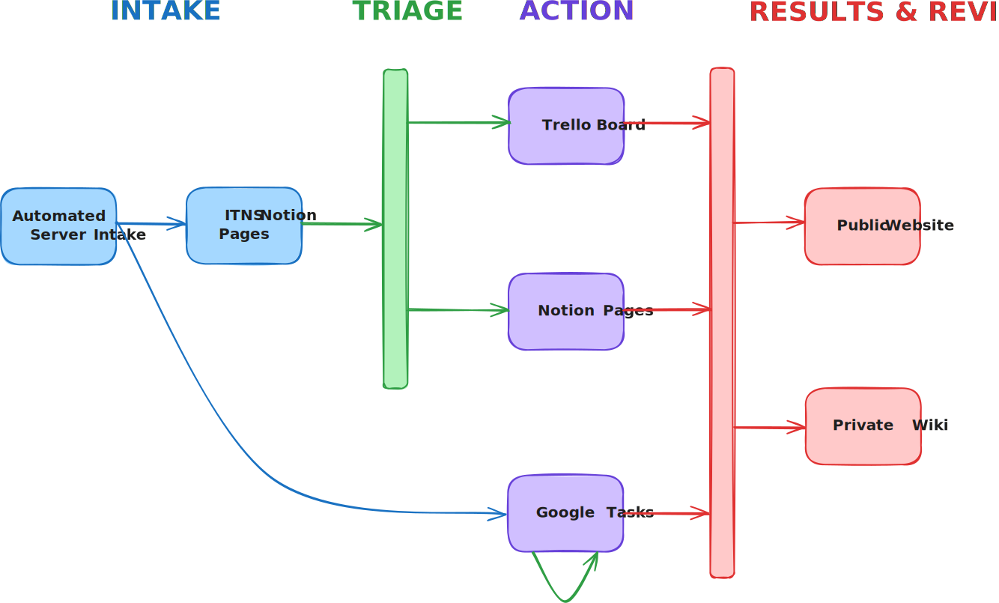

# My Philosophy of Productivity

Test text. When you’ve done the planning and prioritization work, you can be confident in setting aside chunks of time to execute on what you set out to do in a focused manner. And that’s how the most effective work gets done.

More test text.
